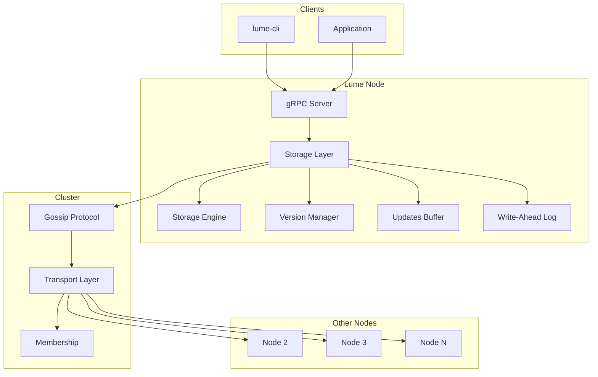

<p align="center">
  <h1 align="center">🗄️ Lume</h1>
  <p align="center">
    <strong>Распределенная in-memory база данных на основе CRDT</strong>
  </p>
</p>

<p align="center">
  <a href="https://golang.org/"></a>
  <a href="https://github.com/kestfor/in-memorydb/actions"></a>
  <a href="https://goreportcard.com/report/github.com/kestfor/in-memorydb"></a>
  <a href="https://deepwiki.com/kestfor/in-memorydb"></a>
  <a href="LICENSE"></a>
</p>

<p align="center">
  <a href="#-ключевые-особенности">Особенности</a> •
  <a href="#-быстрый-старт">Быстрый старт</a> •
  <a href="#-архитектура">Архитектура</a> •
  <a href="#-документация">Документация</a>
</p>

---

**Lume** — это высокопроизводительная распределенная база данных в памяти, использующая CRDT (Conflict-free Replicated Data Types) для обеспечения eventual consistency без конфликтов в распределенной среде.

## 📋 Содержание

- [Ключевые особенности](#-ключевые-особенности)
- [Быстрый старт](#-быстрый-старт)
- [Установка](#-установка)
- [Использование](#-использование)
- [Архитектура](#-архитектура)
- [API](#-api)
- [Конфигурация](#-конфигурация)
- [Тестирование](#-тестирование)
- [Бенчмаркинг](#-бенчмаркинг)
- [Документация](#-документация)
- [Участие в разработке](#-участие-в-разработке)
- [Лицензия](#-лицензия)

## 🚀 Ключевые особенности

| Особенность | Описание |
|-------------|----------|
| **CRDT-архитектура** | Eventual consistency без конфликтов — PN-Counter и LWW-Register |
| **Статическое шардирование** | 256 шардов с независимыми блокировками для высокой конкурентности |
| **Gossip протокол** | Эпидемическое распространение обновлений между узлами |
| **Hybrid Logical Clock** | Монотонные временные метки для версионирования |
| **Write-Ahead Log** | Устойчивость к сбоям с сегментированным WAL |
| **gRPC API** | Высокопроизводительное API с поддержкой protobuf |
| **Observability** | Интеграция с OpenTelemetry, Prometheus и Grafana |
| **Tombstone + GC** | Безопасное удаление данных с garbage collection |

## 🏁 Быстрый старт

### Требования

- Go 1.24+
- protoc (для генерации gRPC кода)
- Docker & Docker Compose (опционально)

### Запуск одного узла

```bash
# Клонирование репозитория
git clone https://github.com/kestfor/in-memorydb.git
cd in-memorydb

# Установка зависимостей
go mod tidy

# Сборка
go build -o bin/lume-server ./cmd/grpc
go build -o bin/lume-cli ./cmd/lume-cli

# Запуск сервера
./bin/lume-server --config templates/node-template.yaml
```

### Запуск кластера через Docker

```bash
cd local_tests
docker-compose up -d
```

## 📦 Установка

### Из исходников

```bash
go install github.com/kestfor/in-memorydb/cmd/grpc@latest
go install github.com/kestfor/in-memorydb/cmd/lume-cli@latest
```

### Сборка с помощью Makefile

```bash
# Запуск тестов
make test

# Линтинг
make lint

# Форматирование кода
make format

# Генерация protobuf
make proto-gen-win
```

## 💻 Использование

### CLI клиент (lume-cli)

```bash
# Подключение к серверу (по умолчанию localhost:9090)
lume-cli -s localhost:9090

# Создание счетчика и установка значения
lume-cli set myCounter 100

# Создание регистра со строковым значением
lume-cli set myRegister "Hello, World!"

# Создание пустого CRDT объекта
lume-cli set myKey --type counter
lume-cli set myKey --type register

# Получение значения
lume-cli get myKey

# Удаление ключа
lume-cli delete myKey

# Операции с счетчиком
lume-cli apply inc myCounter 10   # Инкремент
lume-cli apply dec myCounter 5    # Декремент

# Операции с регистром
lume-cli apply set myRegister "New Value"
```

### gRPC API (программный доступ)

```go
package main

import (
    "context"
    "log"
    
    "google.golang.org/grpc"
    "google.golang.org/grpc/credentials/insecure"
    pb "in-memorydb/api/lumepb"
)

func main() {
    conn, err := grpc.Dial("localhost:9090", grpc.WithTransportCredentials(insecure.NewCredentials()))
    if err != nil {
        log.Fatal(err)
    }
    defer conn.Close()
    
    client := pb.NewLumeClient(conn)
    
    // Создание счетчика
    _, err = client.Set(context.Background(), &pb.SetRequest{
        Key:      "visits",
        CrdtType: pb.Type_TYPE_PN_COUNTER,
    })
    
    // Инкремент счетчика
    _, err = client.Apply(context.Background(), &pb.ApplyRequest{
        Key: "visits",
        Operation: &pb.ApplyRequest_CounterOperationInc{
            CounterOperationInc: &pb.ApplyRequest_CounterInc{Val: 1},
        },
    })
    
    // Получение значения
    resp, err := client.Get(context.Background(), &pb.GetRequest{Key: "visits"})
    log.Printf("Visits: %d", resp.GetCounterData().GetVal())
}
```

## 🏗️ Архитектура



### Основные компоненты

| Компонент | Описание |
|-----------|----------|
| **Storage Engine** | Шардированное хранилище с 256 независимыми шардами |
| **Version Manager** | Управление версиями и разрешение конфликтов |
| **Updates Buffer** | Буферизация обновлений для эффективной передачи |
| **WAL** | Сегментированный Write-Ahead Log для durability |
| **Gossip** | Эпидемический протокол распространения обновлений |
| **Membership** | Управление членством в кластере (SWIM протокол) |

### Типы данных CRDT

#### PN-Counter (Positive-Negative Counter)
Распределенный счетчик с поддержкой инкремента и декремента.

```
Node A: +5         Node B: +3, -1
        ↓                  ↓
    Merge → Итоговое значение: 7
```

#### LWW-Register (Last-Writer-Wins Register)
Регистр с разрешением конфликтов по временной метке HLC.

```
Node A: "value1" @ T=10    Node B: "value2" @ T=15
                 ↓
         Победитель: "value2" (T=15 > T=10)
```

## 📡 API

### gRPC Endpoints

| Метод | Описание |
|-------|----------|
| `Set(SetRequest)` | Создание нового CRDT объекта |
| `Get(GetRequest)` | Получение значения по ключу |
| `Delete(DeleteRequest)` | Удаление ключа (tombstone) |
| `Apply(ApplyRequest)` | Применение операции (inc/dec/set) |

### Типы CRDT

| Тип | Protobuf Enum | Описание |
|-----|---------------|----------|
| PN-Counter | `TYPE_PN_COUNTER` | Счетчик с инкрементом/декрементом |
| LWW-Register | `TYPE_LWW_REGISTER` | Регистр с произвольными данными |

## ⚙️ Конфигурация

Пример конфигурационного файла (`node-template.yaml`):

```yaml
node:
  id: "node1"                    # Уникальный идентификатор узла
  bind_address: "127.0.0.1"      # Адрес привязки
  port: 9090                     # Порт для клиентских запросов

gossip:
  port: 9091                     # Порт для gossip-протокола
  protocol: "SWIM"               # Протокол обнаружения
  interval: 500                  # Интервал anti-entropy (мс)
  fanout: 3                      # Количество узлов для рассылки
  retries: 3                     # Количество повторных попыток

membership:
  port: 9092                     # Порт для проверки членства

seeds:                           # Начальные узлы кластера
  - "192.168.1.10:9090"
  - "192.168.1.11:9090"

persistence:
  wal:
    path: "wal_data"             # Директория WAL
    segment_threshold: 1000      # Записей на сегмент
  snap_dir: "snapshots"          # Директория снапшотов
  snapshot_interval: 10          # Интервал снапшотов

security:                        # TLS конфигурация
  enabled: false
  ca_cert: "ca.crt"
  cert: "node.crt"
  key: "node.key"
```

## 🧪 Тестирование

```bash
# Запуск всех тестов
make test

# Тесты с race detector
go test -race ./...

# Тесты конкретного пакета
go test ./pkg/crdt/...
go test ./pkg/storage/...

# Бенчмарки
make bench
```

## 📊 Бенчмаркинг

Проект включает инструмент `lume-bench` для нагрузочного тестирования:

```bash
# Сборка бенчмарка
go build -o bin/lume-bench ./cmd/lume-bench

# Простой тест (100k запросов, 50 клиентов)
./bin/lume-bench -c 50 -n 100000

# Тест на время (60 секунд)
./bin/lume-bench -t set -c 100 -d 60s

# Смешанная нагрузка
./bin/lume-bench -t mixed -c 50 -d 30s

# С конфигурационным файлом
./bin/lume-bench --config benchmark.yaml

# Экспорт результатов
./bin/lume-bench -t all --json results.json --csv results.csv
```

Подробнее: [cmd/lume-bench/README.md](cmd/lume-bench/README.md)

## 📁 Структура проекта

```
in-memorydb/
├── api/                          # Protobuf определения
│   ├── lume.proto                # gRPC сервис
│   └── lumepb/                   # Сгенерированный Go код
├── cmd/
│   ├── grpc/                     # gRPC сервер
│   ├── lume-cli/                 # CLI клиент
│   └── lume-bench/               # Инструмент бенчмаркинга
├── pkg/
│   ├── configx/                  # Конфигурация
│   ├── crdt/                     # CRDT реализации
│   │   ├── hlc/                  # Hybrid Logical Clock
│   │   ├── pn_counter.go         # PN-Counter
│   │   └── lwwhlc_register.go    # LWW-Register
│   ├── gossip/                   # Gossip протокол
│   ├── membership/               # Управление кластером
│   ├── observability/            # Трейсинг и метрики
│   ├── storage/                  # Storage layer
│   │   ├── engine/               # Движок хранения
│   │   ├── updates_buffer/       # Буфер обновлений
│   │   ├── version_manager/      # Менеджер версий
│   │   └── wal/                  # Write-Ahead Log
│   ├── transport/                # Транспортный слой
│   └── types/                    # Общие типы данных
├── local_tests/                  # Docker конфигурации для тестов
├── observability/                # Grafana, Prometheus, Tempo
├── templates/                    # Шаблоны конфигураций
└── docs/                         # Документация
    ├── RFC.md                    # Техническая спецификация
    └── ROADMAP.md                # План разработки
```

## 📚 Документация

| Документ | Описание |
|----------|----------|
| [Engine v1](pkg/storage/engine/v1/Readme.md) | Документация движка хранения |
| [Benchmark](cmd/lume-bench/README.md) | Руководство по бенчмаркингу |

> 📝 **Примечание:** Полная техническая спецификация (RFC) и план развития (ROADMAP) будут добавлены в директорию `docs/`.

## 🔧 Observability

Проект поддерживает полный стек observability:

```bash
cd observability
docker-compose up -d
```

- **Grafana**: http://localhost:3000 — визуализация метрик
- **Prometheus**: http://localhost:9090 — сбор метрик
- **Tempo**: http://localhost:3200 — распределенный трейсинг

## 🤝 Участие в разработке

Мы приветствуем вклад в проект! 

1. Fork репозитория
2. Создайте feature branch (`git checkout -b feature/amazing-feature`)
3. Commit изменения (`git commit -m 'Add amazing feature'`)
4. Push в branch (`git push origin feature/amazing-feature`)
5. Откройте Pull Request

### Стиль кода

```bash
# Форматирование
make format

# Линтинг
make lint

# Тесты перед коммитом
make test
```

## 📄 Лицензия

Этот проект распространяется под лицензией MIT.

---

<p align="center">
  Made with ❤️ by <a href="https://github.com/kestfor">kestfor</a>
</p>
